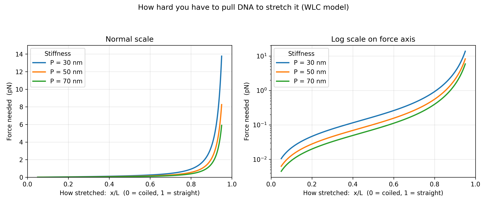

# DNA Force-Extension Model (Worm-Like Chain)
DNA force-extension modeling using the Worm-Like Chain

This project models how much force it takes to stretch a DNA molecule, using a physics model called the Worm-Like Chain. Think of DNA as a floppy, tangled string — the stiffer it is, the harder you have to pull to straighten it out, and no matter how hard you pull, you can never get it perfectly straight. The script tests three stiffness levels and plots how the force needed changes as the DNA gets more stretched, showing that stiffer DNA always needs less force at the same stretch than floppier DNA. This was a first step before working with real experimental data later in the project.

Run it with `pip install numpy matplotlib` then `python wlc_simple.py` — this regenerates the plot above and prints a quick check confirming the math is correct. Next step: comparing this model against real lab data and seeing how a drug binding to DNA might change its stiffness.
